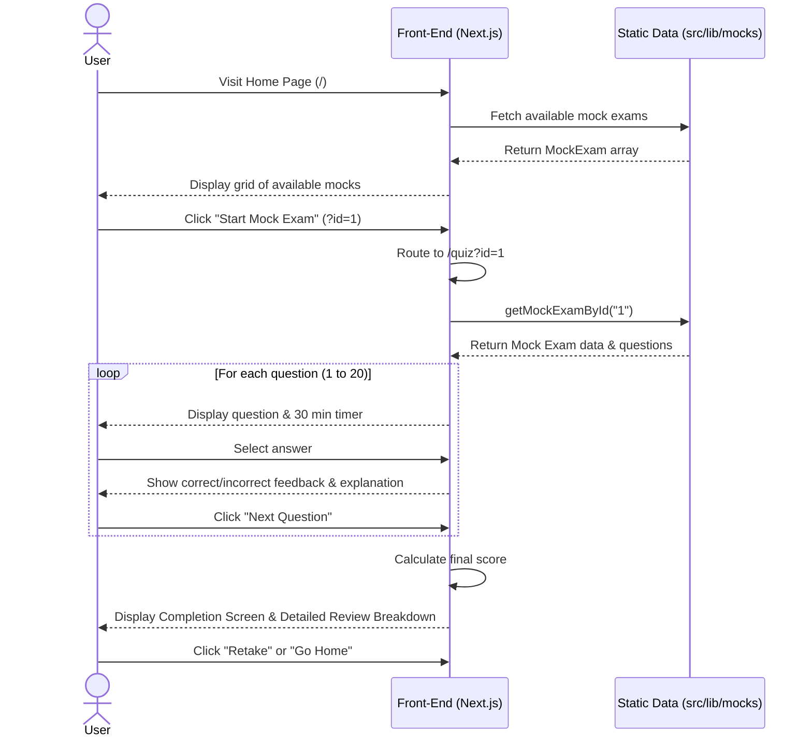
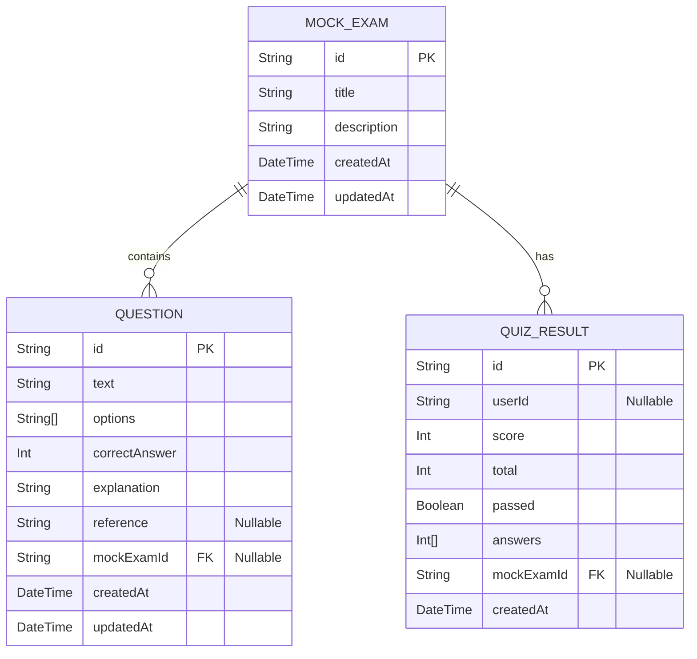

# Architecture Diagrams

## Sequence Diagram (App Flow)

This diagram represents the user flow through the application from the landing page, selecting a mock exam, taking the quiz, and seeing the results.

## Entity Relationship Diagram (ERD)

This diagram represents the data models defined in Prisma that will be used to persist mock exams, questions, and user performance.

